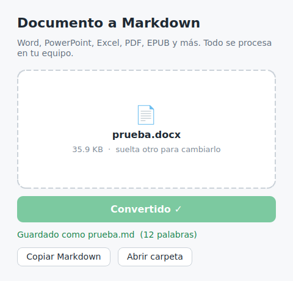

# Conversor MD

Aplicación de escritorio para convertir documentos a Markdown y pasárselos a una IA (Claude, ChatGPT, Gemini…) sin perder la estructura: títulos, listas, tablas y notas.

Arrastras el archivo, pulsas **Convertir** y el `.md` se guarda junto al original. Todo se procesa en tu equipo: ningún documento sale de tu ordenador.



## Por qué

Pegar un Word o un PDF en un chat de IA suele dar problemas: se pierden las tablas, los títulos se mezclan con el texto o el archivo directamente no se admite. Markdown es el formato que los modelos de lenguaje entienden mejor, y además ocupa menos tokens que el documento original.

## Funcionalidades

- Drag & drop de un archivo o selección con el explorador.
- Conversión con un clic y guardado automático en la misma carpeta que el original.
- Nunca sobrescribe: si `informe.md` ya existe, crea `informe (1).md`.
- Botón para copiar el Markdown al portapapeles y pegarlo directamente en la IA.
- Botón para abrir la carpeta donde se ha guardado.
- Mensajes de error claros (archivo protegido con contraseña, PDF escaneado, formato no soportado…).
- La conversión se hace en segundo plano, así la ventana no se congela con documentos grandes.

## Formatos soportados

| Tipo | Extensiones |
| --- | --- |
| Word | `.doc`, `.docx`, `.docm` |
| PowerPoint | `.ppt`, `.pps`, `.pot`, `.pptx`, `.pptm`, `.ppsx`, `.ppsm` |
| Excel | `.xls`, `.xlsx`, `.xlsm`, `.xlsb` |
| OpenDocument | `.odt`, `.ods`, `.odp` |
| Otros | `.rtf`, `.epub`, `.csv`, `.pdf` |

## Descarga

Descarga la última versión desde la página de [Releases](../../releases/latest):

- **Windows:** `ConversorMD-Windows.exe`
- **macOS (Apple Silicon):** `ConversorMD-macOS.zip`

No hace falta instalar Python.

### Aviso en Windows

Como el ejecutable no está firmado, Windows SmartScreen puede mostrar "Windows protegió su PC". Pulsa **Más información → Ejecutar de todas formas**.

### Aviso en macOS

Como la app no está firmada ni notarizada por Apple, la primera vez macOS la bloqueará. Para abrirla:

1. Descomprime el `.zip` y mueve `ConversorMD.app` a **Aplicaciones**.
2. Intenta abrirla una vez (se bloqueará).
3. Ve a **Ajustes del Sistema → Privacidad y seguridad** y pulsa **Abrir igualmente**.

O desde la terminal:

```bash
xattr -dr com.apple.quarantine /Applications/ConversorMD.app
```

## Ejecutar desde el código

Requisitos: Python 3.10 o superior.

```bash
git clone https://github.com/Turidevelop/conversor-md.git
cd conversor-md
```

Crear y activar el entorno virtual:

```powershell
# Windows (PowerShell)
python -m venv .venv
.\.venv\Scripts\Activate.ps1
```

```bash
# macOS / Linux
python3 -m venv .venv
source .venv/bin/activate
```

Instalar dependencias y arrancar:

```bash
pip install -r requirements.txt
python conversor_md.py
```

## Compilar el ejecutable

Instala las dependencias de desarrollo (incluyen PyInstaller):

```bash
pip install -r requirements-dev.txt
```

**Windows** — genera `dist/ConversorMD.exe`:

```powershell
pyinstaller --onefile --windowed --name ConversorMD conversor_md.py
```

**macOS** — genera `dist/ConversorMD.app`:

```bash
pyinstaller --windowed --name ConversorMD --osx-bundle-identifier es.turidev.conversormd conversor_md.py
ditto -c -k --keepParent dist/ConversorMD.app ConversorMD-macOS.zip
```

PyInstaller no compila para otros sistemas: el `.exe` hay que generarlo en Windows y el `.app` en macOS. Para no depender de tener ambos equipos, el repositorio incluye un workflow de GitHub Actions que lo hace automáticamente.

## Publicar una nueva versión

El workflow [`.github/workflows/release.yml`](.github/workflows/release.yml) compila la app en Windows y macOS y crea la release con los dos archivos adjuntos. Se lanza al subir un tag que empiece por `v`:

```bash
git tag v1.0.0
git push origin v1.0.0
```

En unos minutos aparecerá la release en la pestaña **Releases** del repositorio.

## Limitaciones

- **PDF escaneados:** si un PDF es una imagen (por ejemplo, un documento escaneado), no tiene texto que extraer y la app avisará de qué páginas necesitan OCR.
- **Imágenes:** las imágenes incrustadas en los documentos aparecen como su texto alternativo, no como imagen.
- **Archivos protegidos:** los documentos con contraseña hay que desbloquearlos antes.

## Tecnologías

- [anydoc](https://github.com/firecrawl/anydoc) de Firecrawl: motor de conversión escrito en Rust, con bindings para Python.
- [PySide6](https://doc.qt.io/qtforpython-6/) (Qt for Python): interfaz gráfica.
- [PyInstaller](https://pyinstaller.org/): empaquetado en ejecutables.

## Estructura del proyecto

```
conversor-md/
├── .github/
│   └── workflows/
│       └── release.yml      # Compila y publica la release al subir un tag
├── docs/
│   └── captura.png          # Captura usada en este README
├── conversor_md.py          # Aplicación completa
├── requirements.txt         # Dependencias para ejecutar
├── requirements-dev.txt     # Dependencias para compilar
├── .gitignore
├── LICENSE
└── README.md
```

## Licencia

Este proyecto se distribuye bajo licencia [MIT](LICENSE).

anydoc también es MIT. PySide6 se distribuye bajo LGPLv3; los ejecutables generados incluyen las bibliotecas de Qt sin modificar.
